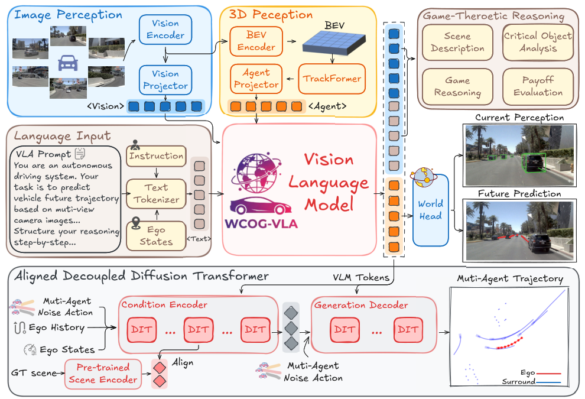

# WCog-VLA: A Dual-Level World-Cognitive Vision-Language-Action Model for End-to-End Autonomous Driving

**Xuerun Yan¹²†, Zhexi Lian¹†, Nuoheng Zhang¹, Shiyu Fang¹, Haoran Wang¹, Chen Lv², Jia Hu¹✉, Binyang Song²✉**

¹ Tongji University, China  
² Nanyang Technological University, Singapore  
† Equal contribution · ✉ Corresponding author

[**Arxiv**](https://arxiv.org/abs/2607.08375)

## Framework

  

## Abstract

Vision-Language-Action (VLA) models have advanced end-to-end autonomous driving. However, existing methods either lack comprehensive world cognition or suffer from fragmented world foresight, inherently confining these models to reactive driving. To address this limitation, we propose **WCog-VLA**, a novel dual-level World-Cognitive VLA framework that successfully bridges semantic world forecasting with generative world evolution to achieve proactive autonomous driving. At the semantic level, WCog-VLA unifies world cognition and reasoning by incorporating 3D spatial perception and injecting agent tokens to capture the world dynamics, while concurrently enabling Game-theoretic Chain-of-Thought (Game-CoT) reasoning. At the generative level, we introduce the **Aligned Decoupled Diffusion Transformer (ADDT)** as a powerful generative world model that synthesizes physically-plausible joint multi-agent trajectories. Through scene representation alignment, ADDT reduces the number of denoising steps required and thus significantly accelerates inference. To facilitate strategic reasoning, we further construct a large-scale dataset featuring **85k Game-CoT annotations**. Extensive experiments on the NAVSIM benchmark demonstrate that WCog-VLA achieves **a State-Of-The-Art (SOTA) PDMS score of 92.9**.
